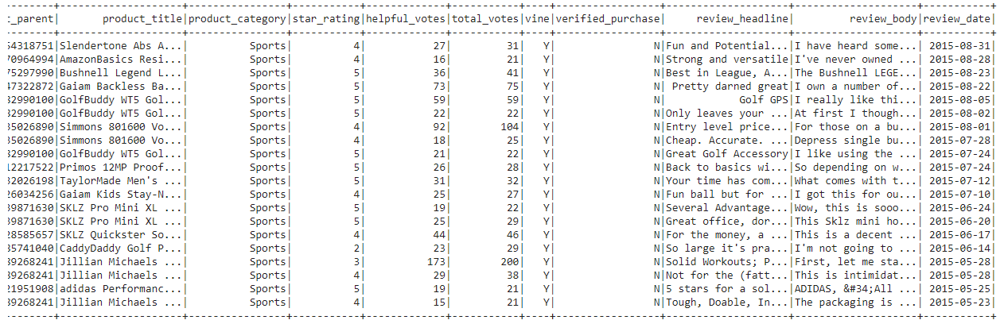
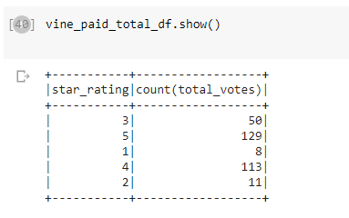
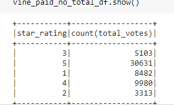

# Amazon_Vine_Analysis

# Summary
The purpose of this analysis was to determine if there was any bias in reviews based on whether or not it was paid for. By analyzing both paid and unpaid reviews, we can see if there are any differences in the amount of 5-star reviews for paid Vine-membership reviews and unpaid reviews. 

# Technologies Used
The main chunk of the work for this analysis came with the ETL process. First, PySpark is used to extract the original data from Amazon S3. The cleaned data is then loaded into a PostgreSQL database in Amazon's RDS system, exported as a CSV and read into a Pandas DataFrame in Jupyter Notebook to complete our analysis. 

## Results
After filtering for all rows where "total votes" was greater than 20 (in order to find reviews most likely helpful), we created two new dataframes, one of them with only paid Vine users, and the other all unpaid users. 

- We see that for paid users there were 129 total 5-star reviews out of 311 (about 41.5%)

- For unpaid users, the total number of 5-star reviews was 30,631 out of 57,509 (about 53.2%)

-Based on these results, it is unlikely there is any positivity bias for reviews in the Vine program. However, more testing and analysis would need to be performed to certify this assumption. 
- Additional analyses that could be done to further back up this assumption would be running the same analysis we just did but on a large sample of S3 datasets. While there was no positivity bias indicated in our analysis of sports equipment reviews, we would need to perform the same analysis on a large random sample of datasets in order to help verify our conclusion.

